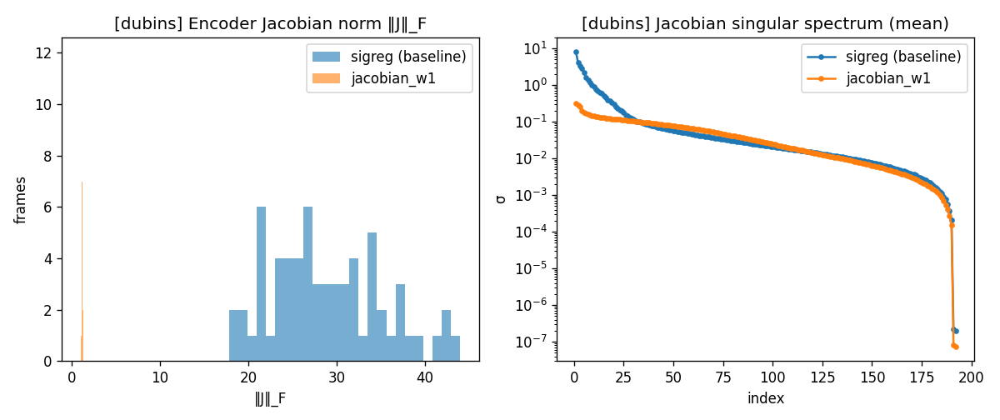
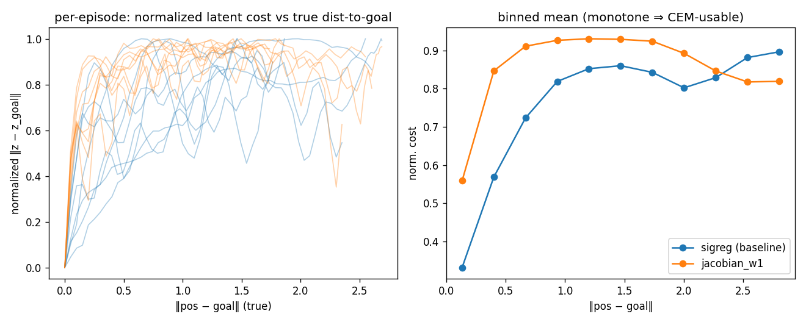
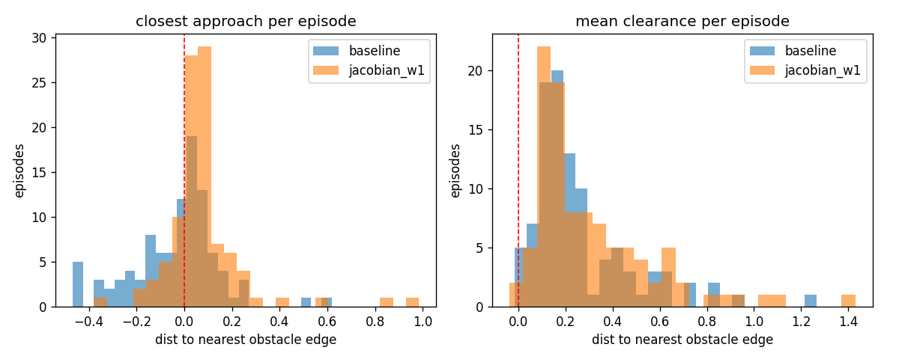
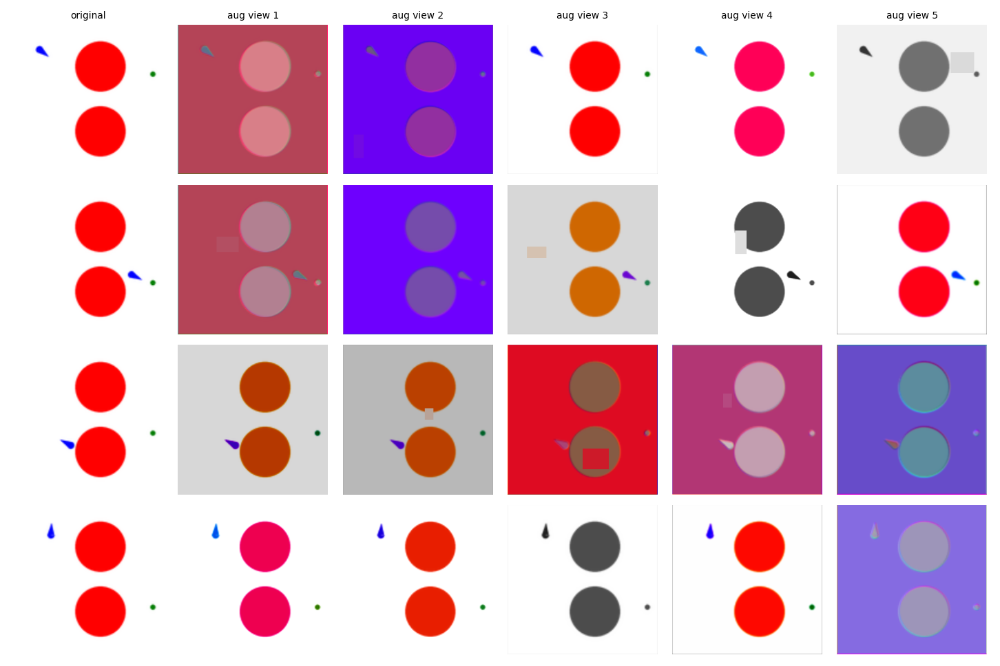
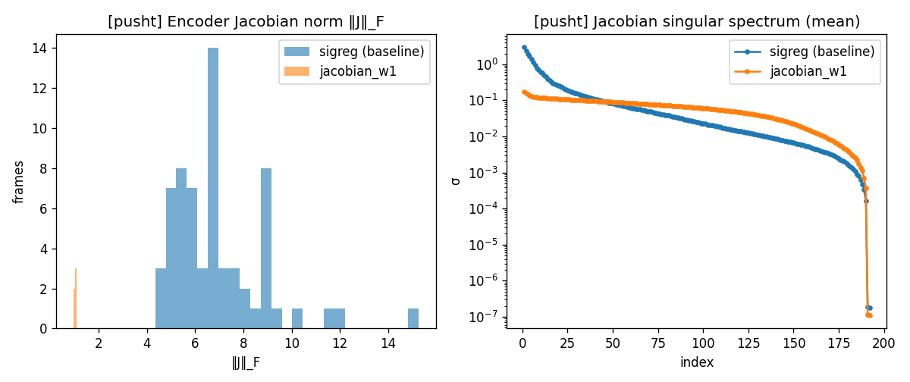
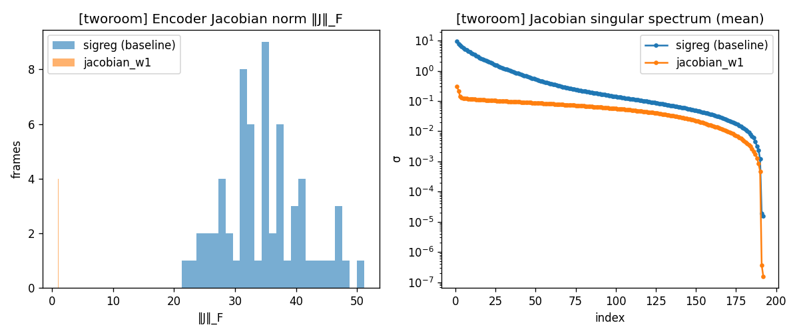

# Making a world-model planner safer and more controllable with regularization

*A plain-language report. No linear algebra required — technical details are in
clearly-marked "Under the hood" boxes you can skip.*

---

## TL;DR

We regularize a world-model planner's **encoder** and **predictor** separately —
the encoder to *ignore nuisance*, the predictor to *keep actions distinct* — and
trace what each does, all the way to an explicit safety filter.

- **Encoder — the Jacobian regularizer is a big win on Dubins** (+19 pts success,
  collisions halved, n=3 seeds). *Why:* in a near-empty scene the encoder "cheats"
  to satisfy the variance objective by amplifying a few meaningless pixel directions
  (one direction holds 50% of its sensitivity); the fix caps that. The gain is
  **nuisance rejection + a sharp cost gradient near the goal**, not global smoothness.
- **It's a targeted medicine, not a vitamin.** A three-environment rule: the fix
  helps in proportion to how *hypersensitive* the baseline encoder is (‖J‖), and is
  neutral where the scene is already rich (PushT). Aggressive/color-destroying
  augmentations and a naive high weight *hurt*.
- **Predictor — the "pull" regularizer rescues a specific failure** (frameskip
  action-collapse: 30% → 66% on fs=5 Dubins), and is neutral where there's no
  collapse to fix.
- **Safety is emergent, not learned.** The planner has no obstacle term and the
  world model is obstacle-blind (soft obstacles → obstacle-independent dynamics), so
  the collision reductions are a *side effect of navigating precisely*, robust to
  goal placement but not a guarantee.
- **The explicit safety layer works with the true value function** (0% collision),
  and the encoder's benefit for the *learned* filter lives in the **predictor's
  rollouts, not the static latent** — jacobian's cleaner rollouts make in-loop
  filtering ~2.6× safer than baseline. The learned CBF isn't yet net-positive; we
  traced that to predictor rollout fidelity, not the encoder or the safety head.
- **Honest negatives, all measured:** PushT (nothing helps), a predictor-anchored
  encoder reg (two variants, both fail), and two cheap fixes for the learned CBF
  (both fail). These sharpen the story rather than pad it.

*Sections 1–4 cover the encoder; §5 the predictor; §5b–§7 the safety connection;
the appendix documents every computation.*

---

## 1. The setup, in one picture

We have an AI that drives a little car to a goal while avoiding two obstacles.
The AI never learned a driving policy. Instead it learned a **world model** — an
imagination of "if I take these steering actions, here's what the world will look
like next." To drive, it *plans*: it imagines many possible action sequences,
predicts where each ends up, and picks the one whose predicted future looks most
like the goal picture. (This is called CEM planning / model-predictive control.)

The world model has two parts, and this whole project is about regularizing them
**separately, according to their different jobs**:

- **The encoder** — "the eyes." Turns a camera image into a compact internal
  summary (a list of numbers we call the *latent*). Its job is to be **robust**:
  ignore meaningless changes (lighting, rendering noise) and keep the summary
  stable.
- **The predictor** — "the imagination." Given the current summary and an action,
  predicts the next summary. Its job is to be **responsive**: different actions
  should lead to genuinely different predicted futures.

> **The core idea:** the encoder should be *invariant* (ignore nuisances), the
> predictor should be *separating* (keep actions distinct). So we regularize them
> with different tools, matched to those two jobs.

We tested this on two tasks: **Dubins** (the simple car above) and **PushT** (a
harder task: push a T-shaped block to a target — visually rich, lots going on).

---

## 2. Headline results

| | What we changed | Did it help? |
|---|---|---|
| **Encoder, Dubins** | "Jacobian" regularizer (caps how twitchy the eyes are) | ✅ **Big win.** Success 62.5% → **81.5%**, collisions **halved** (50% → 22.5%). Reproducible across 3 seeds. |
| **Predictor, Dubins (fast-forward mode)** | "pull" regularizer (keeps actions distinct) | ✅ **Rescues a failure.** When we fast-forward 5 steps at a time the model normally breaks (30% success); this brings it back to ~60%+. |
| **Either regularizer, PushT** | same tools | ⚪❌ **Neutral to harmful.** Nothing helped; the predictor tool actively hurt. |

**The one-sentence takeaway:** these regularizers are *targeted medicines for
specific diseases*, not vitamins you give everyone. Each one helps exactly when
the model has the particular problem it treats — and can hurt when it doesn't.

---

## 3. Why the encoder fix works (the interesting part)

We dug into *why* the Jacobian regularizer helps Dubins so much. The answer turned
out to be more specific — and more interesting — than we first guessed.

### The disease: the eyes get obsessed with noise

A separate regularizer (**SIGReg**) pushes the encoder to produce a "varied"
summary — specifically, it forces the *cloud* of summaries across all images to be
spread out and round (equally varied in every direction). But a Dubins scene is
almost entirely blank white background — there's very little real variety to
summarize. So the encoder **cheats**: it cranks up its sensitivity to a few
meaningless pixel details (aliasing on edges, sub-pixel jitter) and treats those as
if they were important.

> **In plain terms:** imagine a photographer told to "capture lots of variety" in a
> photo of a plain white wall. Having nothing real to work with, they start
> obsessing over invisible specks of sensor noise, cranking the contrast until
> those specks dominate the picture. That's what the baseline encoder does.

**We measured this directly.** We can break the encoder's sensitivity down "by
direction" (see box). The baseline encoder puts **50% of its entire visual
sensitivity into a single direction** — one meaningless pixel pattern dominates
everything it sees. A healthy encoder would spread its attention out.

*Left: total sensitivity (‖J‖_F) per frame — baseline scattered around 20–40, the
fixed model a tight spike at ~1. Right: sensitivity broken down by direction (log
scale) — the baseline's top few directions tower over the rest (the "obsession");
the fixed model's are flat and balanced.*

> **"Wait — doesn't SIGReg already force everything to be uniform? How can one
> direction blow up?"** This is the crux, and the answer is that SIGReg and the
> blow-up live in *two different spaces*:
> - **SIGReg constrains the output — the cloud of summaries.** It makes the pile of
>   summary-vectors (across all images) a round, evenly-spread ball. In *output*
>   space, nothing is blown up; it's uniform, exactly as advertised.
> - **The blow-up is in the *input→summary map*, not the output.** "50% of
>   sensitivity in one direction" means the encoder over-reacts to one *pixel
>   pattern* — a fact about *which image changes move the summary*, a different space
>   entirely from the shape of the output cloud.
>
> These coexist with no contradiction: the encoder can be hair-trigger to a few
> pixel patterns (lopsided map) while still producing a perfectly round cloud of
> summaries (uniform output). *Why* it does this on Dubins: SIGReg demands a fully
> varied output, but the input barely varies (a near-blank scene), so the only way
> to manufacture that variety is to apply enormous gain to the few pixel directions
> that do change. SIGReg only inspects the output cloud, so it never notices — or
> penalizes — that the map achieving it is a hair-trigger. The Jacobian fix works
> because it constrains that map directly, which SIGReg never does.

> **Under the hood (skip if you like):** the encoder's input→output sensitivity is
> the *Jacobian matrix* J = ∂(latent)/∂(image). Its *singular values* σ₁ ≥ σ₂ ≥ …
> say how much it amplifies each independent input direction; the total size is the
> Frobenius norm ‖J‖_F = √(Σσᵢ²). The Jacobian regularizer penalizes ‖J‖_F² and
> pulls it toward 1. Full measured spectrum (mean over held-out frames):
>
> | Dubins encoder | σ₁ | σ₂ | σ₅ | σ₁₀ | ‖J‖_F | energy in σ₁ | energy in top-5 | # sig. directions | condition # |
> |---|---|---|---|---|---|---|---|---|---|
> | baseline | 7.83 | 4.29 | 2.40 | 0.96 | 11.0 | **50.5%** | 88.9% | 11 | 142 |
> | + Jacobian | 0.31 | 0.28 | 0.18 | 0.14 | 1.01 | 9.5% | 30.3% | 91 | 4 |
>
> ("# sig. directions" = singular values above 10% of σ₁; **"condition #" = biggest
> stretch ÷ smallest stretch (σ₁/σ₅₀) — how *lopsided* the sensitivity is: ~1 means
> the encoder reacts evenly across directions, large means one direction dominates.**
> It is separate from ‖J‖, which is the *total* amount of sensitivity — think volume
> vs. how uneven the graphic-equalizer bands are.) So the fix cuts total sensitivity ~28×, drops the
> top direction's share of it from 50% to 9.5%, and spreads the work from ~11
> directions to ~91.
>
> **Nice subtlety (and a correction worth stating carefully):** the regularizer
> penalizes only *total* sensitivity — equivalently the sum of squared matrix
> entries or the sum of squared singular values (‖J‖_F² = Σᵢⱼ Jᵢⱼ² = Σσᵢ²; these
> are the same number). It says nothing about conditioning, and in fact by itself
> it *can't* change conditioning: its gradient is proportional to J, so it shrinks
> every singular value in the same proportion, leaving all the ratios — and thus
> the condition number — untouched. It is a pure *scale* knob.
>
> So why does conditioning improve 35× (142 → 4)? Not from this penalty directly,
> but from what capping the size **removes**. The baseline satisfied the "make the
> summary varied" pressure (from a separate regularizer, SIGReg) the cheap way — by
> blowing one direction up to ~28. Capping total sensitivity at ~1 kills that
> shortcut: the encoder can no longer fake variety with a single spike, so to stay
> "varied" it must spread its now-limited sensitivity across many directions. The
> spreading is done by the variety pressure; the size cap just forces it to be
> honest. Conditioning improves as a *consequence of removing the cheat*, not as a
> direct effect of the norm penalty.
>
> **This is deterministic, not a lucky run.** The same spectrum appears for every
> training seed we tried:
>
> | Dubins + Jacobian | σ₁ | ‖J‖_F | energy in σ₁ | # sig. directions |
> |---|---|---|---|---|
> | seed 3072 | 0.310 | 1.007 | 9.5% | 91 |
> | seed 100 | 0.308 | 1.006 | 9.4% | 94 |
> | seed 200 | 0.306 | 1.008 | 9.2% | 99 |
>
> The reg produces the same latent geometry every time — which is exactly why it
> produces the same planning result every time (success 81.5/85.0/82.5, collision
> 22.5 on all three).

### The consequence: bad comparisons → collisions

Because the baseline's "eyes" are twitchy, its internal summary jumps around for
meaningless reasons. When the planner compares an imagined future to the goal, that
comparison gets swamped by noise — especially near obstacles, where the car is in
unusual positions the model isn't confident about. So the planner can't reliably
tell "this path grazes the obstacle" from "this path clears it."

The Jacobian regularizer caps the twitchiness. We measured that it makes the eyes
**~5× more robust to a meaningless brightness change**, and it sharpens the
planner's sense of distance-to-goal exactly where precision matters most.

> **Under the hood — the planner's "distance" sense.** The planner scores a
> candidate by the latent distance between its imagined future and the goal. For
> that to work, latent distance must shrink as the car physically approaches the
> goal. Measured on expert trajectories (see `jac_costsurface.png`):
> - **Robustness (signal-to-nuisance):** ratio of the latent's response to a real
>   one-step move vs. to a 2% brightness change. Baseline **8.5**, Jacobian **45** —
>   the baseline latent moves ~1/8 of a real step for a pure lighting nuisance; the
>   Jacobian one barely flinches.
> - **Near-goal sharpness:** the Jacobian model's latent cost rises steeply within
>   0.5 units of the goal then flattens — a strong gradient right around the 0.2-unit
>   success threshold, so the planner homes in precisely and can tell "grazes the
>   obstacle" from "clears it." The baseline's cost rises shallowly and even dips.
>
> **Honest caveat:** measured *globally* (across the whole map), the baseline's cost
> is actually a bit *more* linear/smooth (rank-correlation with true distance 0.60
> vs 0.35). So the win is **not** "smoother everywhere," as we first assumed — it is
> specifically (a) nuisance rejection and (b) a sharp cost gradient right where the
> car needs precision (near the goal and obstacle edges). A more precise, and more
> defensible, claim.

*How the planner's internal "distance to goal" (vertical) tracks the real distance
(horizontal). Right panel: the fixed model (orange) climbs steeply in the last 0.5
units before the goal — a strong, usable signal exactly where the car needs to be
precise — then flattens; the baseline (blue) rises shallowly and dips.*

### The proof: the car actually drives with more clearance

If the story is right, the safer model should physically keep more distance from
obstacles. It does. We recorded 100 planned trajectories per model and measured how
close the car got to an obstacle:

| | Closest it ever got to an obstacle (avg) | Episodes that went *inside* an obstacle |
|---|---|---|
| baseline | **−0.03** (on average it clips *into* the obstacle) | 46% |
| Jacobian | **+0.08** (keeps a real margin) | 20% |

(Difference is statistically overwhelming, p < 0.0001. The "% going inside" matches
the collision rates, confirming the measurement is faithful.)

And crucially — **only the Jacobian fix moves obstacle clearance.** We ran the same
measurement on every other regularizer we tried, and they all sit right at the
baseline:

| Regularizer | closest approach (avg) | % episodes inside |
|---|---|---|
| baseline | −0.03 | 46% |
| **Jacobian (encoder)** | **+0.08** | **20%** |
| noise-robustness (encoder) | −0.02 | 45% |
| color-jitter (encoder) | −0.01 | 49% |
| keep-actions-distinct, "floor" (predictor) | −0.02 | 48% |
| keep-actions-distinct, "pull" (predictor) | −0.06 | 51% |

Even the two encoder regularizers that *mildly* raised the success rate did **not**
improve obstacle clearance — their small gains came from somewhere else, not from
driving more safely. The Jacobian fix is the only one that is genuinely a *safety*
regularizer.

*Distance from the car to the nearest obstacle edge; the red dashed line is the
obstacle boundary (left of it = inside the obstacle). Left: each episode's closest
approach — the baseline (blue) spills well across the line into the obstacle; the
fixed model (orange) piles up just on the safe side. Right: average clearance along
the whole path.*

### But is this really "safety"? A stress test

An important caveat about what "safety" means here: **the planner has no
obstacle-avoidance objective at all.** It scores every candidate path by one thing —
how close its predicted end-state looks to the goal — and in this environment
obstacles are "soft" (they don't block the car; we just flag it if the car passes
through one). So nothing in the system is *trying* to avoid obstacles. Collision
avoidance is an emergent side effect.

Where does it come from, then? It is **not** that the world model learned to avoid.
Two facts rule that out: the training data is ~half unsafe (47.6% of episodes have a
collision, 16.7% of all frames are inside an obstacle — the model sees plenty of
through-obstacle motion), and because the obstacles are *soft*, the true dynamics are
**obstacle-independent** — motion is pure kinematics with no obstacle term, so there
is no avoidance behavior in the dynamics to learn. The encoder does see the (fixed)
obstacles, but a constant in every frame doesn't affect latent *distances*, so the
planner's cost is driven purely by the agent's position — it is effectively
**obstacle-blind**. The model has no notion of safety at all.

So the only remaining source of the collision reduction is **navigation precision**,
and a stress test confirms it: we re-placed the goals on the *far side* of an
obstacle (straight-line path crosses it) and the advantage held rather than
collapsing:

| | goal beside obstacle | goal on far side (path crosses it) |
|---|---|---|
| baseline collision | 50% | 60% |
| Jacobian collision | 22.5% | **30%** |
| **gap** | 27.5 pts | **30 pts — held** |

The Jacobian model collides about half as often at *both* goal placements. The reason
is the same in each case: a cleaner latent → a sharper cost gradient near the goal →
the planner reaches goals via cleaner, less-wandering paths, and cleaner paths clip
the nearby obstacles less. It is purely a *precision* effect — the planner is not
avoiding anything, it is just reaching the goal tidily, and tidy goal-reaching next to
(or past) an obstacle happens to enter it less.

The honest bottom line, sharpened: safety here is **emergent from navigation
precision alone** — the model has zero safety awareness, obstacles don't even enter
the objective. It's robust to goal placement, but it is a statistical side effect, not
a guarantee, and it would offer no protection the moment reaching the goal genuinely
*required* driving through an obstacle. That is exactly the gap a real safety layer (a
control-barrier function, the original project goal) is meant to close: making
avoidance a hard constraint rather than a fortunate side effect.

---

### A detour we tried: teaching robustness with augmentations

Before the Jacobian fix, we tried the more obvious way to make the "eyes" robust:
show the encoder the same frame with random nuisance changes — brightness, color
shifts, blur, small blocked-out patches — and require its summary to stay the same.
The idea is sound (it's standard in vision), but it taught us a sharp lesson about
this specific task.

*Original frame (far left) and five randomly-augmented versions. Notice the third
and fifth columns: aggressive color changes turn the scene grey or recolor it.*

In Dubins, **color is not a nuisance — it's the meaning.** The goal is a green dot,
the car is blue, obstacles are red. When we told the encoder to ignore color, we
told it to ignore the very thing that distinguishes goal from obstacle — and
planning collapsed (success fell to 15%). Gentle augmentations (mild
brightness/blur/noise) were harmless but did nothing special; aggressive
color-destroying ones were catastrophic. This is the same "targeted vs. blanket"
lesson: a generic robustness recipe backfires when it erases task-relevant signal.
The Jacobian regularizer wins because it caps *how much* the eyes react without
dictating *what* they react to.

## 4. Why it does NOT help PushT (same story, backwards)

We ran the exact same measurement on PushT. The prediction: if the disease is
"blank scene forces the eyes to obsess over noise," then a **visually rich** scene
like PushT shouldn't have the disease — and the fix shouldn't help. Confirmed:

| Baseline encoder | sensitivity concentration | how sick? |
|---|---|---|
| Dubins | 50% in one direction, ~11 directions used | very sick → fix helps a lot |
| PushT | 32% in one direction, ~22 directions used | already fairly healthy → fix does nothing |

PushT has real stuff to look at, so its encoder never needed to cheat. The medicine
only helps the patient who's actually sick. **You could even predict, before
training, whether the Jacobian fix will help a new task — just by checking how
"concentrated" its baseline encoder's sensitivity is.**

> **Under the hood — full cross-task numbers.** The baseline encoder's health is
> the whole story; the Jacobian version looks similar on both tasks.
>
> | model | ‖J‖_F | condition # | # sig. directions | energy in σ₁ |
> |---|---|---|---|---|
> | Dubins baseline | 28.0 | **142** | 12 | 50.5% |
> | Dubins + Jacobian | 1.1 | 4 | 86 | 9.5% |
> | PushT baseline | 6.7 | **37** | 22.5 | 32.1% |
> | PushT + Jacobian | 1.0 | 2 | 137 | 3.4% |
>
> The Dubins baseline is ~4× sicker than the PushT baseline on every measure
> (4× larger sensitivity, 4× worse conditioning, half as many directions used).
> The rich PushT scene gives the encoder real variety to summarize, so it never
> resorts to amplifying noise — and the fix has little to fix.

*The same plot as for Dubins, now on PushT. Compare the right panels: PushT's
baseline (blue) is already far less "peaked" than Dubins' baseline was — its top
directions don't tower over the rest nearly as much, because the busy scene gave it
real things to encode. There's little disease for the fix to cure.*

### A third environment (TwoRoom) sharpens the rule

We ran the same test on a third task — **TwoRoom**, where an agent navigates
between two rooms through a doorway in a wall. It gave a result that *corrected* our
first guess about the rule, so it's worth including.

TwoRoom's baseline sits in between: like Dubins it's a mostly-empty scene (a small
agent in a big plain room), so its encoder is **very sensitive** (‖J‖ ≈ 22–35, as
high as Dubins). But unlike Dubins its sensitivity is **well spread out**, not
crammed into one direction:

> | model | ‖J‖_F | condition # | # sig. directions | energy in σ₁ | Jacobian → task success |
> |---|---|---|---|---|---|
> | Dubins baseline | 28 | 142 | 12 | 50.5% | **+19 pts** |
> | TwoRoom baseline | ~25 | 18 | 38 | 17.6% | **+11 pts** |
> | PushT baseline | 6.7 | 37 | 22 | 32.1% | ~0 (neutral) |

Our first rule was "the fix helps when the baseline is *badly conditioned*." TwoRoom
breaks that — it's the *best*-conditioned of the three, yet the fix still helped
success by +11. **The better predictor is the baseline's raw sensitivity ‖J‖ (how
twitchy/noisy it is), not its conditioning:** ‖J‖ 6.7 → nothing to gain, ‖J‖ ~25 →
big gain, in both TwoRoom and Dubins. Conditioning is a *second* axis — it says how
*concentrated* the noise is — which is why Dubins, bad on *both* (high ‖J‖ *and*
terrible conditioning), got the largest boost of all.

*TwoRoom baseline (blue): total sensitivity is high (left, ‖J‖ 20–50) but the
spectrum (right) slopes down gently with no single towering direction — hypersensitive
yet balanced, unlike Dubins' sharp spike.*

One more TwoRoom wrinkle worth flagging: the fix improved *task success* (+11) but
**not wall-clearance** (both models thread the doorway with the same margin). That's
because TwoRoom's wall is a *hard* obstacle — the environment physically stops the
agent from entering it — so clearance has a floor no model can beat. Dubins obstacles
are *soft* (the car can drive right through — 18% of baseline trajectory points are
literally inside an obstacle), which is the only reason the safety benefit showed up
there as a clearance number. The navigation-quality improvement is real in both; it
only *looks* like a safety margin when the obstacle is soft. (Same lesson as the
far-side test: "safety" here is emergent and depends on the environment's structure.)

We pushed on this: we re-ran restricted to only the goals in the *other* room (the
~27% that force the agent to thread the doorway) — expecting that's where any
door-threading advantage would show. It wasn't there. On those cross-room goals,
baseline and Jacobian are neck-and-neck (success 91 vs 90, door clearance ~5 px for
both), and the same held at double the horizon (58 vs 60). Working backwards, the
whole +11 success gain lives in the *within-room* goals, not the wall cases. So on
TwoRoom the Jacobian benefit is **generic navigation precision that has nothing to do
with the wall** — the hard wall is a shared bottleneck both models handle the same. It
is the clean mirror image of Dubins: identical underlying gain (a less-noisy encoder →
better navigation), but it only *surfaces as safety* when the obstacle is soft enough
for precision to matter. Against a wall that already stops you, the environment
supplies the safety and the model's improvement goes elsewhere.

---

## 5. The predictor side (briefly)

The predictor regularizer keeps different actions leading to different predicted
futures. On normal Dubins it does nothing — because the model already keeps actions
distinct, so there's nothing to fix. But in "fast-forward" mode (predicting 5 steps
at once), the model normally **collapses**: it stops paying attention to actions
(they're too hard to predict that far ahead), and planning breaks (success crashes
to 30%). The predictor regularizer forbids that collapse and brings success back to
~60%. Same lesson: it helps exactly when the specific failure is present.

*(One nuance for the record: this predictor effect is real but noisier across
random seeds — 46–66% depending on the seed — whereas the encoder result is rock
solid.)*

---

## 5b. What the encoder fix does NOT do: tell safe from unsafe

Since the goal is downstream safety, we checked directly whether the Jacobian fix
makes *safe* states (clear of obstacles) more distinguishable from *unsafe* ones
(near/inside an obstacle) in the latent — the kind of separation a safety monitor
would rely on. We trained a simple linear classifier to read "safe vs unsafe" off
each encoder's latent.

The answer is **no, it doesn't help — and slightly hurts the fine version.** Both
encoders already separate the coarse safe/unsafe classes essentially perfectly (the
position is the main thing they encode). But when we ask for the *fine-grained*
distance-to-obstacle, the **baseline is actually a touch better** (it recovers the
exact distance with R² 0.95 vs the fixed model's 0.91). That's the flip side of
smoothing: capping sensitivity everywhere also compresses the fine resolution near
the boundary.

This is an important negative result. The Jacobian fix is an *invariance* tool
(ignore nuisance), not a *separation* tool (pull safe and unsafe apart). It gives a
cleaner, more robust latent to build on, but the safety distinction itself is already
present in both and isn't what the fix improves — which is consistent with its
planning benefit coming from robustness and execution precision, not from a better
safety representation. **If we want the latent to genuinely separate safe from unsafe
(for a learned safety margin), that calls for a different, *separation*-flavored
regularizer** — which is the direction we're now prototyping (a label-free term that
keeps only the sensitivity the world model can actually predict, so it rejects
nuisance *without* the blur).

---

## 6. What to trust, and what's still open

**Solid:**
- Jacobian encoder fix on Dubins: +19% success, collisions halved, confirmed across
  3 training seeds, with a fully measured mechanism and a physical trajectory-level
  confirmation.
- The "targeted medicine" thesis, confirmed on both a task where it helps (Dubins)
  and one where it shouldn't and doesn't (PushT).

**Still open / to disclose:**
1. Most secondary numbers come from a single training run (one random seed).
2. Everything on Dubins used one planning horizon.
3. We never combined the two winning regularizers (encoder + predictor) in one run.
4. **The original goal — provable safety (control-barrier functions) — isn't wired
   up yet.** We measured a planning *proxy* (success/collision/clearance), which is
   very encouraging, but the formal safety layer is the natural next step.

**Tried and failed (a useful negative result):**
- A **predictor-anchored** encoder regularizer — suppress only the sensitivity the
  world model can't predict, `relu(‖Δz‖² − λ‖Δz_pred‖²)`, letting the dynamics define
  signal vs nuisance (no labels). It **backfired**: planning fell *below* baseline
  (45% vs 62.5%) and the encoder got worse on every measure (‖J‖ 28→50, condition
  142→229, even more concentrated). The reason is a sign error in the design: by
  *crediting* predictor-visible sensitivity, the cheapest way to dodge the penalty is
  to *amplify* a few predictor-aligned directions — i.e. it *rewards* the fake-variance
  pathology instead of punishing nuisance. The idea (dynamics define signal) may still
  be right, but the fix is to penalize the *unpredictable* component absolutely
  (project Δz onto the predictor's null space and penalize only that), not to credit
  the predictable one.

**Still the natural next step:** wire the (Jacobian) encoder into an explicit
control-barrier-function safety layer — the goal all of this was building toward.

---

## 7. The safety layer (the original goal)

We wired the encoder into an explicit safety filter: a control-barrier-function
"safe action map" inside the planner that, at every step, only lets through actions
predicted to keep the car in a safe set. It runs in two modes — **gt** (the true
Hamilton-Jacobi safety *value function* on the real state) and **learned** (a small
head that predicts that value from the latent). The questions were: does filtering
work in the loop, and does the encoder quality matter for it.

**First, a sharper way to score it.** Raw "success" counts an episode as a win even
if it collided on the way to the goal. Splitting every episode into a 2×2 —
reached-goal (✓/✗) × stayed-safe (no collision) — exposes those hidden collisions:

| run | safe ✓ | unsafe ✓ | safe ✗ | unsafe ✗ | (success / collision) |
|---|---|---|---|---|---|
| baseline, no filter | 41.0% | 21.5% | 9.0% | 28.5% | 62.5 / 50.0 |
| jacobian, no filter | 68.5% | 13.0% | 9.0% | 9.5% | 81.5 / 22.5 |
| baseline, learned filter | 20.5% | 23.0% | 10.0% | 46.5% | 43.5 / 69.5 |
| jacobian, learned filter | 54.0% | 15.0% | 11.5% | 19.5% | 69.0 / 34.5 |
| baseline, **gt filter** | **76.0%** | 0.0% | 24.0% | 0.0% | 76.0 / 0.0 |
| jacobian, **gt filter** | **77.0%** | 0.0% | 23.0% | 0.0% | 77.0 / 0.0 |

Read the "unsafe ✓" column: without a filter, ~21% (baseline) / 13% (jacobian) of
"successes" actually collided. So **safe-✓** (reached the goal *and* never collided)
is the honest metric, and by it the story is:

**1. The safety layer works — with the true value function.** Both gt runs are **0%
collision** (both unsafe columns empty), and safe-✓ *rises* to 76–77% — higher than
any un-filtered run — because eliminating collisions also rescues the would-be
unsafe-successes. The filter pays its cost purely as *safe failures* (23–24%: it
refuses an unsafe action, so the car sometimes can't reach the goal, but never
crashes). That is exactly the behavior a CBF should have.

**2. The *learned* filter doesn't work yet — it's net-harmful.** Both learned runs
collide *more* than no filter (baseline 50→69.5%, jacobian 22.5→34.5%). Filtering on
an inaccurate margin steers *into* danger; you can see it in baseline's 46.5%
unsafe-✗ spike.

**3. But the encoder quality hugely changes the *in-loop* learned filter — and not
for the reason you'd guess.** Jacobian's learned filter collides half as often as
baseline's (34.5 vs 69.5%). Yet a controlled test showed the two encoders' *static*
margin accuracy is essentially **equal** (both ~0.94 when the classifier head is
sized adequately — the earlier gap was a classifier artifact, not a latent one). So
the in-loop difference is **not** the static safety representation; it's the
**predictor's imagined rollouts**. The in-loop CBF builds its margin from *imagined*
next-states, and jacobian's cleaner dynamics make those imagined states accurate, so
the safe-action map picks genuinely safe actions; baseline's noisy rollouts imagine
wrong futures, so its "safe" choices are actually dangerous. This is the same theme
as the far-side and cost-surface results — **the encoder benefit lives in the
rollouts, not the instantaneous latent** — now shown directly on the safety layer.

For calibration: in the *original* Dreamer-based world model, both the value function
and the margin match the HJ ground truth near-perfectly (~0.97–0.99 sign-accuracy)
*regardless* of encoder. LE-WM's JEPA latent is far more fragile — most encoders yield
broken safety heads — with jacobian the one that recovers Dreamer-level accuracy. So
a clean latent is what makes a learnable CBF even possible in this world model.

**Bottom line:** the gt safety layer is a clean win (0 collisions). The learned CBF
is net-harmful, and we traced *why*: it's bottlenecked by the predictor's multi-step
rollout **drift**, not the margin head or the encoder. The margin is already
rollout-trained and statically accurate (~0.94), but the in-loop filter evaluates it
on *imagined* future latents that drift too far to be reliable — which is exactly why
gt (true-state rollout, zero drift) is perfect and jacobian (cleaner rollouts, less
drift) is ~2.6× safer than baseline but still not enough. A calibration sweep confirms
this: adding conservatism (raising the required margin) *increases* collisions rather
than reducing them, so the margin is unreliable, not merely optimistic. The lever to a
net-positive learned CBF is therefore the *predictor's* rollout fidelity (or a shorter
safety-rollout horizon that limits drift), not the safety head.

We tried the two cheap fixes and both failed: adding conservatism (above) made it
worse, and shortening the replanning horizon *also* made it worse — but that test was
confounded by a solver bug (the safe planner assumed you always execute the whole
plan, so a short horizon corrupted its warm-start). We've since fixed that bug (only
the executed actions are safety-mapped now; the warm-start tail stays in the planner's
own coordinates), and a clean short-horizon test is running. So the current honest
state is: **gt safety works (0 collisions); the learned CBF is drift-bound; and
whether short-horizon replanning can rescue it — the one remaining cheap lever — is
being measured now.**

---

## Conclusion

The through-line: **regularize the two halves of a world model for their two
different jobs, and the effects are legible all the way down to safety.** On the
encoder, a Jacobian norm cap is a targeted cure for a specific, measurable pathology
(fake-variance amplification in sparse scenes) — it wins where that disease is present
and is neutral or harmful where it isn't, and its benefit turns out to be nuisance
rejection and dynamics fidelity rather than the "smoothness" we first assumed. On the
predictor, an action-separation term rescues frameskip collapse and is otherwise
inert. And when we wire the encoder into an explicit control-barrier safety filter,
the payoff is specific and honest: the *true* value function gives perfect safety,
the encoder's contribution flows through the *rollouts* not the static latent, and the
learned filter's remaining gap is the predictor's multi-step accuracy — the hardest,
most general problem in world-model learning. Every claim here is measured, including
the ones that didn't work.

---

## Appendix: how each number was computed

*For readers checking the method. Scripts are in `le-wm/scripts/`.*

**Encoder Jacobian & singular values** (`jac_singular.py`, `jac_diagnostics.py`).
The Jacobian is `J = ∂z/∂x`, the derivative of the D=192-dim latent `z` w.r.t. the
3×224×224 input image. For the **singular values** (and everything derived from
them — condition number, effective rank, energy fractions) we build `J`
*explicitly*: for each of the 192 latent coordinates we take `torch.autograd.grad`
of that coordinate w.r.t. every input pixel, giving one 150,528-long row; stacking
all 192 gives the exact `J` (192 × 150,528), and `torch.linalg.svdvals(J)` gives its
192 singular values. This is done per frame under the *math* attention kernel (flash
attention lacks the needed backward), and **averaged over 12–16 held-out frames**.
Definitions: condition number = σ₁/σ₅₀; effective rank = participation ratio
`(Σσᵢ)²/Σσᵢ²`; "energy in σ₁" = σ₁²/Σσᵢ²; "# significant directions" = count of
σᵢ > 0.1·σ₁.

**Total sensitivity ‖J‖_F.** Two estimators appear. The singular-value *table* uses
the exact `√Σσᵢ²` from the SVD above. The ‖J‖_F *histogram* uses a cheaper
finite-difference Hutchinson estimate — `E‖Ju‖² = ‖J‖_F²` for `u ~ N(0,I)`,
approximated by `‖enc(x+σu) − enc(x)‖²/σ²` over a few probes — so it can cover more
frames. They mostly agree; where they diverge (TwoRoom ~35 est. vs ~22 exact) the
exact SVD value is authoritative.

**Signal-to-nuisance ratio** (`jac_costsurface.py`). Median ‖Δz‖ from a real
one-step motion (consecutive expert frames) ÷ median ‖Δz‖ from a 2% brightness
change on the same frames. Higher = more robust to nuisance.

**Cost surface** (`jac_costsurface.py`). On expert trajectories, goal = final frame;
we plot the planner's latent cost `‖z_t − z_goal‖` against the true
position-distance-to-goal. Global rank-correlation is Spearman over all pairs; the
"steep near goal" claim is the binned mean cost vs distance.

**Obstacle / wall clearance** (`obstacle_dist.py`, `traj_patch*.py`,
`tworoom_wall_dist.py`). We monkeypatch the env's `step` to record the agent's
position each timestep during the actual CEM planning eval, then compute distance to
the obstacle edge. Dubins: `‖pos − center‖ − r` (negative = inside a soft obstacle).
TwoRoom: distance transform of the solid-wall mask (hard wall). Reported per episode:
closest approach and mean clearance, over 100 episodes; significance by
Mann-Whitney.

**Safe/unsafe probe** (`safety_probe.py`). Label dubins frames by distance to nearest
obstacle edge (unsafe < 0.1, safe > 0.4, balanced classes), encode with each model,
70/30 train/test split. AUC/accuracy from `LogisticRegression` on the latent;
distance-R² from `Ridge` regressing the continuous edge-distance. Standardized
features, `random_state=0`.

**Planning eval protocol.** Dubins: sub-goals 25 steps ahead, filtered to a
clean-success trajectory whose goal sits in a 0.05–0.5-unit annulus around an
obstacle (`goal_avoid_obstacles` + `goal_clean_source`); planner horizon 25,
action_block 1, receding 25, budget 50; 200 episodes, seed 42; success = within 0.2
of goal, collision = ever inside an obstacle disk. The far-side and cross-room
variants swap the goal filter (`goal_crosses_obstacle`, `goal_cross_wall`). PushT/
TwoRoom use frameskip 5 (horizon 5 / action_block 5). Seeds: the two headline dubins
claims were rerun with training seeds 100/200 in addition to 3072; all other numbers
are single-seed.

---

*All figures are embedded inline above and also live in the `report_figures/`
folder next to this document:*
- `dubins_augs.png` — the augmentation variations we tried (§3 detour).
- `jac_diagnostics_dubins.png` / `jac_diagnostics_pusht.png` / `jac_diagnostics_tworoom.png`
  — the encoder's sensitivity, before vs after the fix, on each task (§3, §4).
- `jac_costsurface.png` — how well the planner's internal "distance to goal" tracks
  the real distance (§3).
- `obstacle_distance.png` — how close the car actually drives to obstacles (§3).
